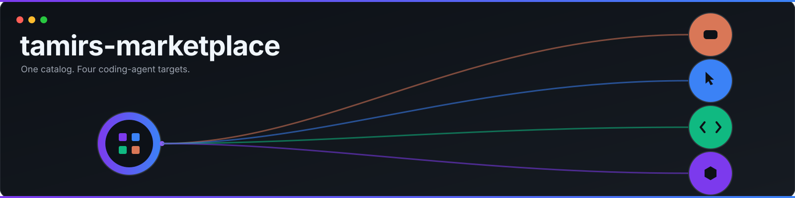

<p align="center">
  
</p>

<h1 align="center">tamirs-marketplace</h1>

<p align="center">
  <a href="https://github.com/Tamircohen28">
    
  </a>
  <a href="https://github.com/Tamircohen28/tamirs-marketplace/actions/workflows/ci.yml">
    
  </a>
  <a href="LICENSE">
    
  </a>
  
  
  
  
  
</p>

<p align="center">
  A unified multi-platform plugin catalog for <a href="https://github.com/Tamircohen28">@Tamircohen28</a> — one marketplace install for <a href="https://code.claude.com/docs/en/plugin-marketplaces">Claude Code</a>, <a href="https://cursor.com/docs/plugins">Cursor</a>, and <a href="https://developers.openai.com/codex/plugins">Codex</a>, plus native skill discovery on <a href="https://opencode.ai/docs/skills/">OpenCode</a>.
</p>

---

## Features

- **Single install point** — add one marketplace to get all plugins, no per-repo configuration
- **Catalog only** — this repo holds marketplace manifests only; plugin source lives in each plugin's own repo
- **Four targets** — Claude Code, Cursor, Codex, and OpenCode; the Cursor and Codex manifests are generated from one canonical source
- **Standalone too** — every plugin here also installs on all four targets *without* this catalog
- **Auto-updated** — each plugin entry pins a branch so you always get the latest compatible version
- **Schema-validated** — CI regenerates and validates all manifests on every push

## Supported targets

| Target | Minimum | Validated against | Catalog install | Install guide |
|--------|---------|-------------------|-----------------|---------------|
| [Claude Code](https://code.claude.com/docs/en/plugin-marketplaces) | 2.0.0 | **2.1.226** | ✅ marketplace | [claude-code.md](docs/user/install/claude-code.md) |
| [Cursor](https://cursor.com/docs/plugins) | 3.14.7 | **3.14.7** | ✅ team marketplace | [cursor.md](docs/user/install/cursor.md) |
| [Codex](https://developers.openai.com/codex/plugins) | 0.40.0 | **0.146.0** | ✅ marketplace | [codex.md](docs/user/install/codex.md) |
| [OpenCode](https://opencode.ai/docs/skills/) | 1.16.2 | **1.18.11** | ❌ no marketplace — install per plugin | [opencode.md](docs/user/install/opencode.md) |

Every version above was read from the CLI itself, not inferred from release notes. Floors,
verification methods, and OpenCode's documented capability gaps:
[platform-targets.md](docs/engineering/build-and-release/platform-targets.md).

## Plugins

| Plugin | Repo | Description |
|--------|------|-------------|
| `tamirs-superpowers` | [Tamircohen28/tamirs-superpowers](https://github.com/Tamircohen28/tamirs-superpowers) | 26 skills, smart worktree hooks, statusline, and MCP stubs for a full dev workflow. |
| `jose-claudinho` | [Tamircohen28/jose-claudinho](https://github.com/Tamircohen28/jose-claudinho) | AI manager for Sport5 Fantasy World Cup 2026. |
| `headhunter` | [Tamircohen28/headhunter](https://github.com/Tamircohen28/headhunter) | Job-search CRM with Gmail/Calendar/Notion/Todoist integrations. |

Each of those repos is independently installable on all four targets — see its own
`docs/user/install/` directory.

## Prerequisites

- A supported host from the table above.
- **Contributors only:** Python 3 (used by `make generate` / `make validate` to regenerate and check manifests). No runtime dependencies are required to *install* plugins.

## Quick Start

**Contributors:** `make install` once, then `make validate` before every PR.

### Claude Code

Inside Claude Code or from the `claude` CLI:

```bash
# 1. Add this marketplace
claude plugin marketplace add Tamircohen28/tamirs-marketplace

# 2. Install the plugins you want
claude plugin install tamirs-superpowers@tamirs-marketplace
claude plugin install jose-claudinho@tamirs-marketplace
claude plugin install headhunter@tamirs-marketplace

# 3. Confirm they're installed
claude plugin list
```

Slash-command equivalent inside Claude Code:

```text
/plugin marketplace add Tamircohen28/tamirs-marketplace
/plugin install tamirs-superpowers@tamirs-marketplace
/doctor
```

### Codex

```bash
# 1. Add this marketplace (sparse checkout keeps the clone small)
codex plugin marketplace add Tamircohen28/tamirs-marketplace --ref main --sparse .agents/plugins

# 2. See what's available
codex plugin list --marketplace tamirs-marketplace

# 3. Install plugins
codex plugin add tamirs-superpowers@tamirs-marketplace
codex plugin add jose-claudinho@tamirs-marketplace
codex plugin add headhunter@tamirs-marketplace
```

The subcommand is `codex plugin add` — there is no `codex plugin install` and no `--source`
flag. Codex reads `.agents/plugins/marketplace.json`, **not** `.codex-plugin/marketplace.json`.

In the Codex app: **Settings → Plugins → + Add More…** and paste `https://github.com/Tamircohen28/tamirs-marketplace`.

### Cursor — team marketplace (Teams / Enterprise)

Org admins import this repo as a private team marketplace:

1. **Dashboard → Plugins → Team Marketplaces → Add Marketplace → Import from Repo**
2. Repository: `https://github.com/Tamircohen28/tamirs-marketplace`
3. Save and assign distribution groups

Developers install optional plugins from the in-editor marketplace panel.

### Cursor — local development (any user)

Test a plugin locally before it is published or indexed remotely:

```bash
git clone https://github.com/Tamircohen28/tamirs-superpowers
ln -s "$(pwd)/tamirs-superpowers" ~/.cursor/plugins/local/tamirs-superpowers
```

Restart Cursor or run **Developer: Reload Window**.

### OpenCode

OpenCode has **no marketplace**, so this catalog cannot be added as an install source. Clone
the plugin you want — OpenCode discovers its skills natively from the `opencode.json` each
plugin repo ships:

```bash
git clone https://github.com/Tamircohen28/tamirs-superpowers
cd tamirs-superpowers
opencode
opencode debug skill    # verify what loaded
```

Details, config gotchas, and the full list of OpenCode capability gaps:
[docs/user/install/opencode.md](docs/user/install/opencode.md).

> Listed plugin repos must ship `.cursor-plugin/plugin.json` and `.codex-plugin/plugin.json` for Cursor and Codex installs to succeed. See [Troubleshooting](docs/user/troubleshooting.md).

## Documentation

Per-target install guides: [docs/user/install/](docs/user/install/README.md).
Full user guide, concepts, and troubleshooting are in [`docs/`](docs/README.md).

## Contributing

See [`docs/CONTRIBUTING.md`](docs/CONTRIBUTING.md) — edit the Claude manifest, run `make generate`, and open a PR.

## License

MIT © [Tamir Cohen](https://github.com/Tamircohen28)
